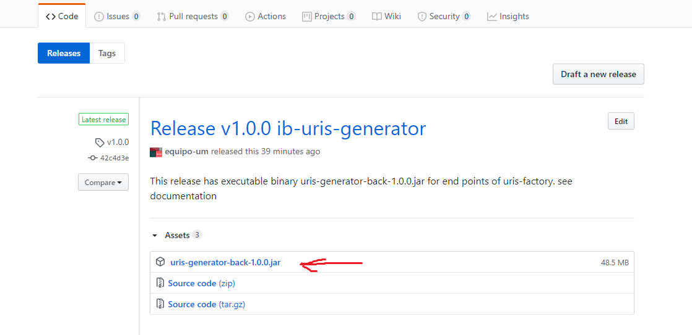

| Entregable    | Librería factoria de URIs                                    |
| ------------- | ------------------------------------------------------------ |
| Fecha         | 28/04/2021                                                   |
| Revisado por  | Paloma Terán Pérez                                           |
| Proyecto      | [ASIO](https://www.um.es/web/hercules/proyectos/asio) (Arquitectura Semántica e Infraestructura Ontológica) en el marco de la iniciativa [Hércules](https://www.um.es/web/hercules/) para la Semántica de Datos de Investigación de Universidades que forma parte de [CRUE-TIC](https://www.crue.org/proyecto/hercules/) |
| Módulo        | Arquitectura Semántica                                       |
| Tipo          | Documentación                                                |
| Objetivo      | El presente documento describe el proceso de compilación y despliegue de la librería Factoría de URIs |
| Documentación | [Esquema de URIs](https://github.com/HerculesCRUE/ib-asio-docs-/blob/master/entregables_hito_1/08-Esquema_de_URIs_Hércules/ASIO_Izertis_ArquitecturaDeURIs.md)<br/>[Buenas practicas para URIs Hércules](https://github.com/HerculesCRUE/ib-asio-docs-/blob/master/entregables_hito_1/09-Buenas_prácticas_para_URIs_Hércules/ASIO_Izertis_BuenasPracticasParaURIsHercules.md)<br/>[Manual de usuario](./manual_de_usuario.md) (documentación de alto nivel)<br />[Documentación técnica](./documentacion-tecnica.md) (documentación de bajo nivel)<br/>[Documentación API REST de la Factoria de URIs](./documentacion_api_rest_de_la_factoria_de_uris.md) (documentación de bajo nivel)<br/>[README](../README.md)<br/>[docker](./docker.md) |

# Compilación

En el presente documento se describen los pasos necesarios para compilar/ejecutar la presente librería. Para ello se detallan los pasos necesarios, según el perfil de usuario, pudiéndose así adaptar a distintos entornos de despliegue

## Despliegue del entorno

La librería Factoría de URIs, usa MariaDB para gestionar la persistencia de la URIs, por lo tanto todos los pasos mencionados en este documento, necesitan un acceso a una base de datos MariaDB. Los parámetros de conexión para la base de datos pueden establecerse por variables de entorno tal como se indica en el fichero [README.md](https://github.com/HerculesCRUE/ib-uris-generator/blob/master/README.md#variables-de-entorno) (sección Variables de entorno).

También es posible y recomendable desplegar el entorno (con MariaDB adecuadamente configurado para su uso por la librería). Esto esta descrito en en el fichero [README.md](https://github.com/HerculesCRUE/ib-uris-generator/blob/master/README.md#entorno-de-desarrollo-docker) (sección entorno de desarrollo Docker).

## Despliegue de la librería

Se describen los siguientes modos para ejecutar la aplicación según el perfil de usuario:

#### Usuarios finales

En la presente sección se describen los pasos a seguir por un usuario final, el cual definimos como aquel usuario que únicamente tiene interés en  ejecutar la librería de la forma más simplificada posible, abstrayéndose de detalles de implementación.

Para ello daremos dos opciones:

##### Ejecución sobre SSOO nativo

###### Requisitos

* OpenJDK 11 (disponible [aquí](https://openjdk.java.net/projects/jdk/11/))
* Maven 3.6.x (disponible [aquí](https://maven.apache.org/download.cgi))

###### Despliegue y ejecución

Para ello tenemos que seguir los siguientes pasos:

1. Descarga de binarios de la ultima release en el [repositorio de la librería](https://github.com/HerculesCRUE/ib-uris-generator/releases) o mediante el siguiente [enlace](https://bintray.com/herculescrue/backend-sgi/download_file?file_path=es%2Fum%2Fasio%2Furis-generator-1.0.0.jar) 

   

   


2. Configurar variables de entorno (si no queremos aplicar los valores por defecto) tal como se indica en [README.md](https://github.com/HerculesCRUE/ib-uris-generator/blob/master/README.md#variables-de-entorno)
3. Ejecutar librería desde el fichero .jar descargado mediante el siguiente comando siguiente comando (desde el directorio donde se encuentra el .jar)

```bash
java -jar uris-generator-back-1.0.0.jar
```

3. Una vez ejecutado el jar tendremos desplegados (SERVER_PORT por defecto esta configurado a 9326):
   - Aplicación URIS Factory: http://localhost:{SERVER_PORT}
   - Swagger URIS Factory: http://localhost:{SERVER_PORT}/swagger-ui.html

##### Ejecución sobre contenedor Docker

###### Requisitos

* Docker (disponible [aquí](https://docs.docker.com/get-docker/))

###### Despliegue y ejecución

Para ello tenemos que seguir los siguientes pasos:

1. Descargar imagen Docker desde su repositorio en Docker Hub ([imagen en docker hub](https://hub.docker.com/r/herculescrue/uris-generator)) con el siguiente comando

   ```bash
   docker pull herculescrue/uris-generator:latest
   ```

2. Configurar variables de entorno (si no queremos aplicar los valores por defecto) tal como se indica en [README.md](https://github.com/HerculesCRUE/ib-uris-generator/blob/master/README.md#variables-de-entorno)

3. Ejecutar imagen descargada con el siguiente comando

   ```bash
   docker run -e APP_PERSISTENCE_DATASOURCE_DRIVER-CLASS-NAME=org.mariadb.jdbc.Driver -e APP_PERSISTENCE_DATASOURCE_USERNAME={usuario_en_ddbb} -e APP_PERSISTENCE_DATASOURCE_PASSWORD=sqlpass -e APP_PERSISTENCE_DATASOURCE_URL=jdbc:mariadb://127.0.0.1:3307/app?ssl=false -p 9326:9326 herculescrue/uris-generator:latest
   ```

   - -d: Indica que se ejecute en segundo plano
   - -p: establece el mapeo de puertos entre el puerto externo y el puerto interno
   - -t: Tag que se aplacará a el contenedor.

#### Desarrolladores

En la presente sección se describen los pasos a seguir por un usuario técnico o avanzado, el cual definimos como aquel usuario interesado en los detalles de la implementación y con acceso al codigo fuente.

##### Compilación

###### Requisitos

* Git (disponible [aquí](https://git-scm.com/book/en/v2/Getting-Started-Installing-Git))
* OpenJDK 11 (disponible [aquí](https://openjdk.java.net/projects/jdk/11/))
* Maven 3.6.x (disponible [aquí](https://maven.apache.org/download.cgi))

Para ello tenemos que seguir los siguientes pasos:

1. Descarga de el código fuente en el repositorio del proyecto

   ```bash
   git clone https://github.com/HerculesCRUE/ib-uris-generator.git
   ```

2. Compilación del proyecto con el comando 

   ```bash
   mvn clean package
   ```

   Este comando, compilara el proyecto, gestionara las dependencias , ejecutara los test y creara los ejecutables binarios

##### Ejecución sobre SSOO nativo

###### Requisitos

* Los anteriores

###### Ejecución

1. Buscar y acceder modulo **uris-generator-back** y copiar el ejecutable **uris-generator-back-1.0.0.jar** a el directorio deseado para su ejecución.

2. Configurar variables de entorno (si no queremos aplicar los valores por defecto) tal como se indica en [README.md](https://github.com/HerculesCRUE/ib-uris-generator/blob/master/README.md#variables-de-entorno)

3. Ejecutar el comando

   ```bash
   java -jar uris-generator-back-1.0.0.jar
   ```

4. Una vez ejecutado el jar tendremos desplegados (SERVER_PORT por defecto esta configurado a 9326):

   - Aplicación URIS Factory: http://localhost:{SERVER_PORT}
   - Swagger URIS Factory: http://localhost:{SERVER_PORT}/swagger-ui.html

##### Ejecución sobre contenedor Docker

###### Requisitos

* Docker (disponible [aquí](https://docs.docker.com/get-docker/))

###### Ejecución

1. Buscar y acceder por consola a el directorio **docker-build**, donde se encuentra el fichero Dockerfile de configuración para creación del contenedor.

2. Ejecutar el comando para crear la imagen del contenedor

   ```bash
   docker build --tag {nombre_imagen:versión_imagen} .
   ```

3. Configurar variables de entorno (si no queremos aplicar los valores por defecto) tal como se indica  en [README.md](https://github.com/HerculesCRUE/ib-uris-generator/blob/master/README.md#variables-de-entorno)

4. Ejecutar imagen creada con el siguiente comando

   ```bash
   docker run -d -p {puerto_externo:puerto_interno} {nombre_imagen:versión_imagen} -t {nombre_imagen:versión_imagen}
   ```

   - -d: Indica que se ejecute en segundo plano
   - -p: establece el mapeo de puertos entre el puerto externo y el puerto interno
   - -t: Tag que se aplacará a la imagen.

5. Una vez ejecutado el jar tendremos desplegados (SERVER_PORT por defecto esta configurado a 9326):

   - Aplicación URIS Factory: http://localhost:{SERVER_PORT}
   - Swagger URIS Factory: http://localhost:{SERVER_PORT}/swagger-ui.html

### Modulos

#### Back

Los artefactos se encuentran dentro de uris-generator-back/target

* Artefacto: uris-generator-back-{version}.jar

#### Service

Los artefactos se encuentran dentro de uris-generator-service/target

* Artefacto: uris-generator-service-{version}.jar

#### Service Abstractions

Los artefactos se encuentran dentro de triples-storage-adapter-service-abstractions/target

* Artefacto: triples-storage-adapter-service-abstractions-{version}.jar

#### JPA Abstractions

Los artefactos se encuentran dentro de triples-storage-adapter-jpa-abstractions/target

* Artefacto: triples-storage-adapter-jpa-abstractions-{version}.jar

#### Swagger

Los artefactos se encuentran dentro de triples-storage-adapter-swagger/target

* Artefacto: triples-storage-adapter-swagger-{version}.jar
